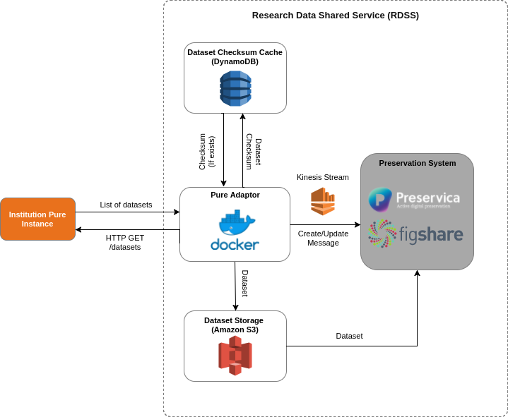

# RDSS Pure Adaptor

[](https://travis-ci.com/JiscRDSS/rdss-pure-adaptor)

## Introduction

The RDSS Pure Adaptor is a per-institution adaptor for installations of the [Pure research information system](https://www.elsevier.com/solutions/pure).

The adaptor periodically polls the `datasets/` endpoint of a Pure installation, fetching new and modified datasets, and relaying these datasets on to the Jisc Research Data Shared Service (RDSS).

At present the RDSS Pure Adaptor can interact with version 5.9 of the Pure API, but is designed to easily accommodate interaction with other versions of the API in future.  

## Language / Framework

- Python 3.6+
- Docker

## Service Details

The adaptor runs as a docker container which can be configured to poll the URL of institutions Pure instance API.

A checksum is created for each dataset and stored in DynamoDB to determine if a dataset has been added or modified since the last poll.

If a change is detected, the data is downloaded to S3 and the appropriate `Create` or `Update` Message is published on the configured Kinesis Stream.

The below diagram illustrates how the adaptor functions:



### API Calls

The adaptor will make the following calls to the Pure endpoint:

 - `HTTP HEAD <PURE_API_URL>/datasets` to ensure endpoint is online.
 - `HTTP GET <PURE_API_URL>/datasets` to retrieve a list of datasets.
 - `HTTP GET <PURE_API_URL>/datasets/<UUID>` to retrieve the dataset file.

### CRUD Capabilities

At present, the service supports the following:

**READ** to determine if a dataset has already been harvested.

**CREATE** if a new dataset is added to pure.

**UPDATE** if a dataset has been modified.

### Sub-Services

The RDSS Pure Adaptor depends on the following infrastructure:

- AWS Kinesis Streams
- AWS DynamoDB
- AWS S3 Buckets

## Configuration

The RDSS Pure Adaptor requires that the following environment variables are set:

- `PURE_API_VERSION`

   A string description of the Pure API version being targeted. Used to select the Pure API integration used by the RDSS Pure Adaptor.

- `PURE_API_URL`

   The url of the Pure API endpoint.

- `PURE_API_KEY`

   The api key which is used to authorise access to the Pure API endpoint.

- `INSTANCE_ID`

   A string describing the institution and environment which this instance of the RDSS Pure Adaptor is targeting, e.g. `pure-adaptor-<jisc_id>-<env>`. This is the name of the DynamoDB table used to store the state of the adaptor, as well as the name of the s3 bucket which the adaptor will upload downloaded datasets.

- `RDSS_INTERNAL_INPUT_STREAM`

   The name of the RDSS internal input stream to which the Pure Adaptor will write messages.

- `RDSS_MESSAGE_INVALID_STREAM`

   The name of the RDSS invalid message stream to which the Pure Adaptor will write invalid messages.

- `RDSS_MESSAGE_ERROR_STREAM`

   The name of the RDSS error message stream to which the Pure Adaptor will write error messages.

In addition to the aforementioned variables, the following environment variables are also required by the `boto3` library to access the AWS resources utilised by the RDSS Pure Adaptor:

- `AWS_ACCESS_KEY_ID`
- `AWS_SECRET_ACCESS_KEY`
- `AWS_DEFAULT_REGION`

## Developer Setup

To run the adaptor locally, first all the required environment variables must be set, e.g.:

```
export PURE_API_VERSION=v59
...
```

Then to create a local virtual environment, install dependencies and manually run the adaptor:

```
make env
source ./env/bin/activate
make deps
python ./pure_adaptor/pure_adaptor.py
```

### Testing

To run the test suite for the RDSS Pure Adaptor, run the following command:

```
make test
```

## Frequently Asked Questions

### Is the Pure Adaptor multi tenanted?

No, the pure adaptor is designed to be run once for each specific institution.

The main reason behind this decision is that a per institution setup allows more flexibility to tailor metadata mappings to each institutions requirements.

### What is the impact of polling?

The pure adaptor is setup to poll the configured Pure endpoint once every 30 miniutes.

This means there may be up to a 30 miniute delay before new dataset create messages are published.
